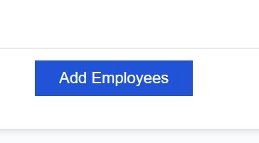
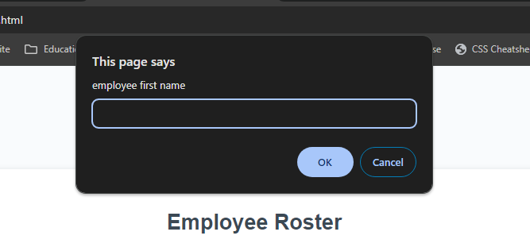

# payroll-tracker

## Description

*This application provides a user-friendly interface for managing employee records.
*When adding a new employee, the user is prompted to enter details such as first name, last name, and salary.
*After each addition, the user has the option to continue adding more employees or to cancel.
*Upon cancellation, the employee data is displayed on the page sorted alphabetically by last name.
*Additionally, the console provides computed and aggregated data for the entered employee records.

##Table of content

N/A

##installation

N/A

## Usage

*Go to the deployed link " #" 

*Click "Add Employees" Button.

*A prompt will display. like this.

*By following the instruction on the prompt input employee information.The input information should be displayed  like the following image.

*Televised description of the Webpage lookes like the following down below.

*Go to this link "#" to checkout the repo on my GitHub.
